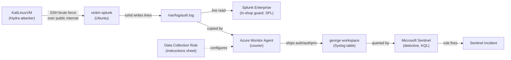

# Detection Lab — Architecture

A small Azure detection lab with a Linux victim, Kali as the attacker, and two SIEMs — Microsoft Sentinel and Splunk — catching the same SSH brute-force in parallel.

## The shop story

Most of this lab is easier to picture as a high street shop with a CCTV system than as a cloud architecture diagram. A list of acronyms — Sentinel, AMA, DCR, Log Analytics — is dry and hard to keep in your head, but a story sticks. So here's the shop story first: a shop, a burglar, and two layers of security both watching the same break-in attempt. The technical mapping comes right after.

Picture a small high-street shop. It's got a front door, a logbook on the counter, and a back room — a self-contained little business that opens, takes traffic in and out, and closes at the end of the day. In our lab, that shop is the Ubuntu Linux VM called `victim-splunk`, running in Azure. It's the **victim** in the attack scenario, and the host where Splunk Enterprise sits installed, which is why we named it that way.

Inside the shop, the shopkeeper is `sshd` — the Linux service that handles every incoming SSH attempt. Every time somebody tries to come through the door, whether they succeed or fail, the shopkeeper writes a line in the logbook on the counter: `/var/log/auth.log`. The shopkeeper doesn't decide whether something is suspicious — they simply note it down. The judging comes later, when the guard and the detective read back through the book.

The guard is `Splunk Enterprise`, installed directly on `victim-splunk`. They sit inside the shop and watch every new line the shopkeeper writes to the logbook — live, as it happens, not as a daily review. Their scope is just this one shop, because Splunk is installed on this one VM only. The language they use to ask questions of the logbook is **SPL** (Splunk's query language).

Now the burglar arrives — brazen, not sneaky. They walk straight up to the door and try thousands of keys in seconds, hoping one fits. In the lab, the burglar is `KaliLinuxVM`, a separate VM running Kali Linux, using `Hydra` to fire hundreds of SSH login attempts per minute against `victim-splunk` — targeting the username `azureuser` with passwords drawn from the `rockyou.txt` wordlist. The burglar and the shop sit on **separate VNets**, so the attack has to travel over the public internet: Kali's public IP knocking on `victim-splunk`'s public IP.

Inside the shop there's a delivery man whose job is to copy every new line written in the logbook and deliver it somewhere else. He doesn't read the logs — he just delivers. The delivery man is **Azure Monitor Agent** (`AMA`), a background process installed on `victim-splunk` that watches the Linux logging system (`rsyslog`) for new events and ships them up to Azure. He doesn't decide where they go — that's set out in an instructions sheet he follows (the next character), and the destination is a warehouse at head office where the detective will eventually read them.

An instruction sheet is given to the courier to follow. It lives at head office and tells the courier three things: what to take from the logbook, where to take it, and what to ignore. This is the **Data Collection Rule** (`DCR`). It tells `AMA` to only ship the `auth` and `authpriv` syslog facilities, ignore the rest (cron noise, daemon chatter, kernel messages), and send them to the `george` workspace at head office. Without a DCR pointing at the VM, AMA does nothing — install ≠ collect. That's a real lesson from the build: the agent was installed successfully, but until the DCR was created with the right facilities ticked, no events arrived.

The warehouse could receive copies from many shops, organise them into folders by category, and store them so detectives can come and read them later. In this lab it only takes deliveries from one shop, but the architecture would scale to many. The warehouse is the **Log Analytics workspace** called `george`, which lives in Azure in the `SecureLogs` subscription — a different subscription from where the VMs themselves live. Inside the workspace, log events are stored in tables; the syslog events from `victim-splunk` land in the table called `Syslog`. The warehouse is centralised — hundreds of VMs could send data to one workspace at once — which is why Sentinel is well-suited to large estates, in contrast to running Splunk inside each individual shop.

The detective sits at head office, never visiting the shops — just reads whatever is in the warehouse folders. They look for trouble across every shop delivery, not just one. They run scheduled queries against the warehouse data and raise an **incident** whenever something matches. The detective is **Microsoft Sentinel**, which sits on top of the `george` workspace and speaks **`KQL`** (Kusto Query Language) rather than SPL. When a Sentinel analytics rule fires, it creates an incident with the attacker's IP listed as an entity — the same brute-force the in-shop guard already caught, now caught a second time by an entirely different security layer.

## Architecture diagram

## Walking the flow

The same architecture, traced through with one failed-login event from `Hydra`'s first attempt to the incident appearing in Sentinel.

1. Each credential attempt is its own TCP connection to `victim-splunk:22`. `Hydra` is firing hundreds of these per minute from `KaliLinuxVM`, each one carrying a username and password pair to test. The traffic travels from Kali's public IP, across the public internet, to `victim-splunk`'s public IP.

2. `sshd` on `victim-splunk` accepts the incoming TCP connection and validates the credentials against the system. The password isn't valid for `azureuser`, so the attempt is rejected. As part of handling the failure, `sshd` writes a line to `/var/log/auth.log` containing the text `"Failed password for azureuser from <Kali's IP> port <X> ssh2"` — and that exact phrase is what every downstream detection later pattern-matches on.

3. At this point the data path forks. The `rsyslog` daemon — the Linux logging service that wrote the auth.log line in the first place — also forwards a copy of the same event to AMA. From here, two parallel paths run independently: Splunk reads the auth.log file directly inside the VM, while AMA ships the event up to the `george` workspace for Sentinel to query. Neither system knows the other is happening; both are working off the same source event.

4. Splunk's file monitor (the `add monitor /var/log/auth.log` input) reads the new line within seconds of `sshd` writing it. The event lands in the `main` index, available to SPL queries. The scheduled alert `Brute-force SSH login attempts` runs every 15 minutes on cron; when it runs, it executes the saved SPL — `source="/var/log/auth.log" "Failed password" | rex "from (?<src_ip>\d+\.\d+\.\d+\.\d+)" | stats count by src_ip | where count > 20` — over the last 15 minutes of data. If any source IP appears with more than 20 fails, the alert fires and a row appears in **Activity → Triggered Alerts** in Splunk.

5. `rsyslog` forwards the event on the `authpriv` facility (per the DCR's instructions) to AMA, running on the same VM. AMA buffers the event briefly, then ships it outbound to the Azure Monitor ingestion endpoint over HTTPS. The event arrives at the `george` Log Analytics workspace and lands in the `Syslog` table. The Sentinel analytics rule `SSH brute-force — failed logins from single IP` runs every 5 minutes, executing the saved KQL over the last 5 minutes of data. If any row comes back (a `src_ip` with more than 20 fails), Sentinel creates an **incident** of Medium severity, with the attacker IP populated as an `IP` entity.

6. End state: the same brute-force is now recorded in both SIEMs, with the same attacker IP and roughly the same fail count. An L1 analyst opening either tool would see the detection — as a **Triggered Alert** in Splunk or an **Incident** in Sentinel — independently of the other.

## Why it's built this way

**Why two SIEMs.** Two SIEMs were used because I wanted hands-on experience with both Splunk and Sentinel, and to show employers I can work with either. A small business wouldn't usually run both — the licensing and ingestion costs add up — but the parallel-SIEM pattern does appear in real architectures: during SIEM migrations (where teams run both in parallel to confirm the new platform catches what the old one does), in large enterprises where different teams cover different domains, and in high-stakes environments running redundant detection. So the lab models a real parallel-SIEM scenario on a tiny scale.

**Cross-subscription workspace.** The VMs live in one subscription (`CyberTechProd`), while the workspace `george` was set up in another (`SecureLogs`). This is a separation-of-concerns pattern: the people who manage the VMs can't tamper with the security logs that record what those VMs did. The DCR itself sits in the workspace's subscription and points across to the VM in another — cross-subscription routing works fine in Azure, but it does require permissions in both.

**Public-IP attack path.** `KaliLinuxVM` and `victim-splunk` sit on separate VNets with no peering between them, so there's no private path between the two networks. As a result, the attack travels over the public internet — Kali's public IP knocking on `victim-splunk`'s public IP. In a real adversary simulation, I'd peer the VNets so the attack ran internally over private addresses, mirroring how a real attacker would pivot inside a network; the public-IP path here is a lab compromise.

**NSG locked to one source IP.** The NSG rule allowing SSH to `victim-splunk:22` is locked down to only Kali's public IP — not the wider internet. Leaving SSH open to `0.0.0.0/0` would guarantee constant brute-force traffic from botnets and scanners; that noise would flood the workspace, drown out the lab's own signal, cost money to ingest, and muddy the demo story. This is the principle of least privilege applied to the network: real SOC teams follow the same pattern — management ports are never exposed to the entire internet, always restricted to known source IPs.
